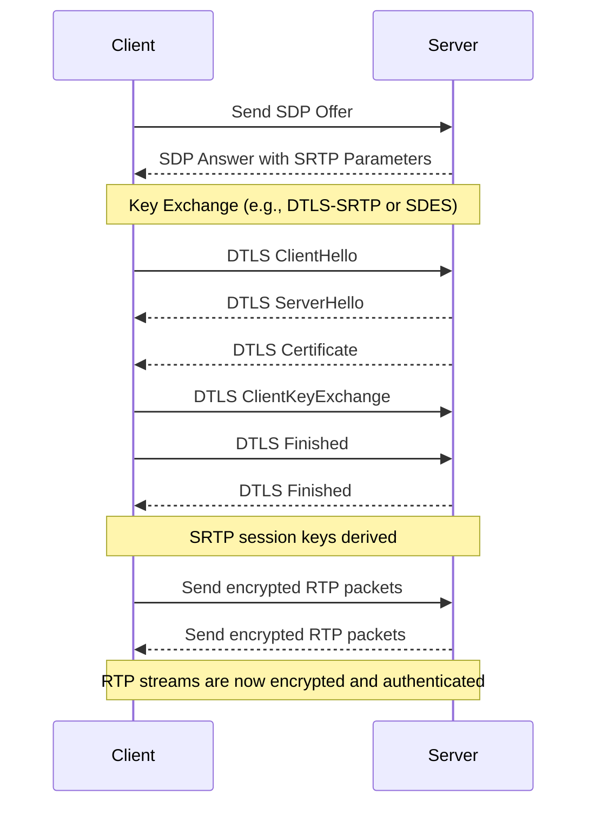

```mermaid 
sequenceDiagram
    participant Client
    participant Server

    Client->>Server: Send SDP Offer
    Server-->>Client: SDP Answer with SRTP Parameters
    Note over Client, Server: Key Exchange (e.g., DTLS-SRTP or SDES)
    Client->>Server: DTLS ClientHello
    Server-->>Client: DTLS ServerHello
    Server-->>Client: DTLS Certificate
    Client->>Server: DTLS ClientKeyExchange
    Client->>Server: DTLS Finished
    Server-->>Client: DTLS Finished
    Note over Client, Server: SRTP session keys derived
    Client->>Server: Send encrypted RTP packets
    Server-->>Client: Send encrypted RTP packets
    Note over Client, Server: RTP streams are now encrypted and authenticated
```