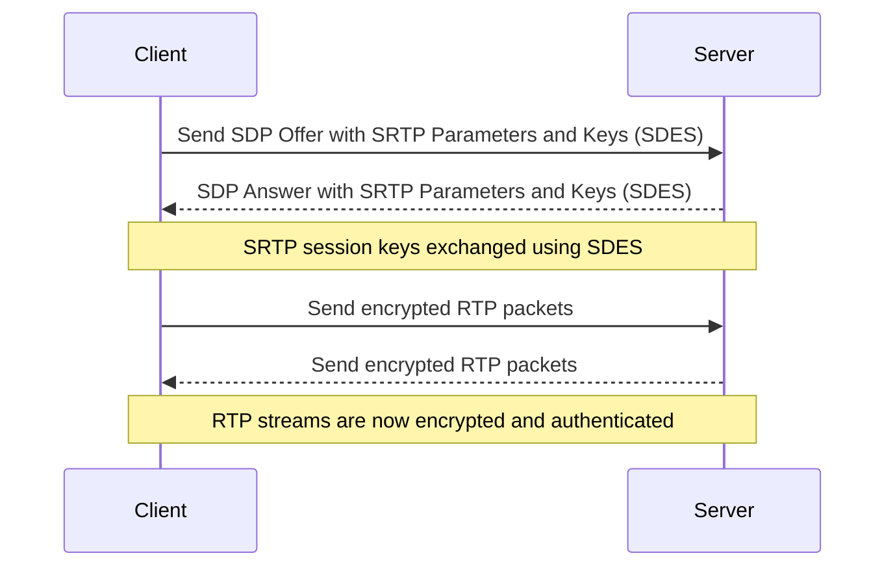

```mermaid
sequenceDiagram
    participant Client
    participant Server

    Client->>Server: Send SDP Offer with SRTP Parameters and Keys (SDES)
    Server-->>Client: SDP Answer with SRTP Parameters and Keys (SDES)
    Note over Client, Server: SRTP session keys exchanged using SDES
    Client->>Server: Send encrypted RTP packets
    Server-->>Client: Send encrypted RTP packets
    Note over Client, Server: RTP streams are now encrypted and authenticated
```