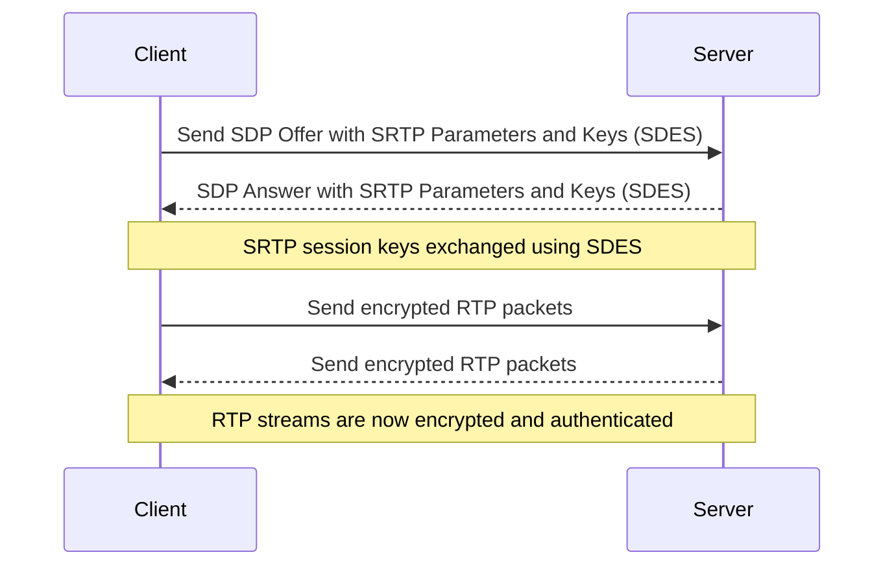

Example SDP (Source: [Oracle](https://docs.oracle.com/en/industries/communications/session-border-controller/9.3.0/configuration/example-dtls-srtp-flows.html) )

OFFER

c=IN IP4 172.16.123.9
t=0 0
**m=audio 11000 UDP/TLS/RTP/SAVP 0
a=rtpmap:0 PCMU/8000
a=rtcp-mux
**a=sendrecv
**a=fingerprint: SHA-1 49:27:AF:1D:BA:94:2B:00:E9:33:0A:9E:3A:B5:93:6D:EF:11:E4:55
**a=setup:active

ANSWER

c=IN IP4 192.168.123.16
t=0 0
**m=audio 10000 UDP/TLS/RTP/SAVP 0
a=rtpmap:0 PCMU/8000
**a=setup:passive
**a=fingerprint:sha-1 AF:F2:99:EF:BF:9D:24:B4:1F:F4:87:83:47:5A:F1:09:1F:2F:89:A1

